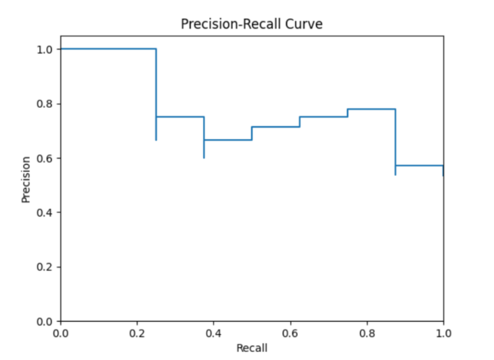

# 🖼️ Visual Search & Image Classification System
**EEE3032 – Computer Vision & Pattern Recognition (University of Surrey)**  
**Author:** Taman Bachani (URN: 6846172)

This project implements a **visual image search system** using handcrafted descriptors (Global RGB Histogram & Spatial Grid) and an **SVM classifier** to categorize real-world images from the MSRC object category dataset

---

## 📦 Key Features

- 📊 **Two handcrafted descriptors**:  
  - Global Color Histogram (RGB quantized into bins)  
  - Spatial Grid (texture + color, with angular quantization)

- 🔍 **Visual Search Engine**: Uses Euclidean distance to return the top N most visually similar images.

- 🤖 **SVM Classifier**: Classifies images using extracted descriptors  
  - Hyperparameter tuning via GridSearchCV  
  - Evaluated using PR curves and confusion matrices

- 📈 Evaluated with **Precision–Recall**, **F1 Score**, and **Confusion Matrix**

---

## 📁 Repository Structure

| File | Description |
|------|-------------|
| `CVPR_SVM_TAMAN_BACHANI_6846172.ipynb` | Full Google Colab notebook |
| `EEE3032_CW1_REPORT_TAMAN_6846172.pdf` | Final coursework report |
| `assets/` | Contains all result visualizations for PR, SVM, and grid search |

---

## 📸 Key Visual Results

### 🎯 PR Curves – Visual Search

| Descriptor | PR Curve |
|-----------|----------|
| RGB Histogram (Bins = 4) |  |
| RGB Histogram (Bins = 16) |  |
| Spatial Grid (Angles = 4) |  |
| Spatial Grid (Angles = 8) |  |

---

### 🧪 SVM Classification Performance

- **Classification with RGB Histogram:**
  

- **Optimized Spatial Grid SVM:**
  

- **Confusion Matrix:**
  

---

## 🧠 Core Libraries Used

- `OpenCV`, `NumPy`, `scikit-learn`, `matplotlib`, `SciPy`

---

## 🔄 How to Run

1. Clone this repository  
2. Upload or mount the MSRC dataset  
3. Run `CVPR_SVM_TAMAN_BACHANI_6846172.ipynb` in Google Colab  
4. All parameters (bins, angles, kernel) are adjustable at the top of the notebook

---

## 📚 Dataset Used

**MSRC Object Category Dataset (v2)**  
- 591 images across 20 object categories  
- [Download Link](http://download.microsoft.com/download/3/3/9/339D8A24-47D7-412F-A1E8-1A415BC48A15/msrc_objcategimagedatabase_v2.zip)

---

## 🧾 Report

The full analysis and results can be found in [`EEE3032_CW1_REPORT_TAMAN_6846172.pdf`](./EEE3032_CW1_REPORT_TAMAN_6846172.pdf).

---

## 👨‍💻 Author

**Taman Bachani**  
MSc Artificial Intelligence – University of Surrey  
📫 [LinkedIn](https://www.linkedin.com/in/tamanbachani) | 📁 [Portfolio](https://github.com/tamanb)

